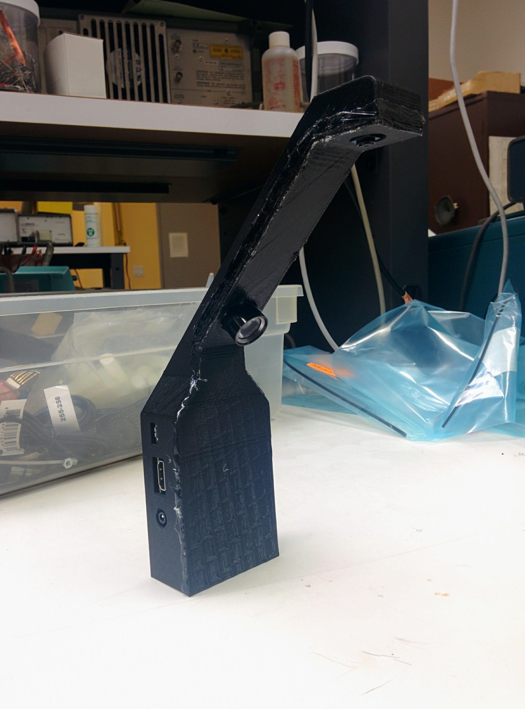

# CribSense Overview

CribSense is a contactless, video-based baby monitor that you can make yourself without breaking the bank.

CribSense is a C++ implementation of the MIT [Video Magnification](http://people.csail.mit.edu/mrub/vidmag/) algorithm that is tuned to run on a Raspberry Pi 3 Model B.
Over a weekend, you can setup your own crib-side baby monitor that raises an alarm if your infant stops moving.
As a bonus, all of the software is free to use for non-commercial purposes and easily extensible.

While we think that CribSense is pretty fun, it is important to remember that this is not actually a certified, foolproof safety device.
That is, CribSense will not work as expected if the system is not calibrated properly.
If the system is not calibrated well or the environment in the video is not conducive to video magnification, you may not be able to use it.
We made this as a fun side project to see how well we could run compute-heavy software, like video magnification, on compute-limited hardware, like a Raspberry Pi.
Any real product would require much more testing than we have done.
If you use this project, take it for what it is: a short exploration of video magnification on a Raspberry Pi.

## Getting Started

CribSense is made up of two parts: the baby monitoring software and some simple hardware.
Find out all you need to know about how to use and recreate your own monitor in the sections below.
You can also view our instructions on [Instructables](http://www.instructables.com/id/CribSense-a-Contactless-Video-based-Baby-Monitor/).

### Software

To install the prerequisites, build the software, or learn more about the software architecture, see the [Software Setup Guide](setup/sw-setup.md).

### Hardware

To learn more about the hardware materials we used, and how we build our setup, check out the [Hardware Setup Guide](setup/hw-setup.md).

## Video Walkthroughs

### Calibrating CribSense

<iframe width="560" height="315" src="https://www.youtube.com/embed/zSiRmgIE3pY?rel=0" frameborder="0" allowfullscreen></iframe>

### CribSense Demonstration

<iframe width="560" height="315" src="https://www.youtube.com/embed/zvy1fXIjGgA?rel=0" frameborder="0" allowfullscreen></iframe>
