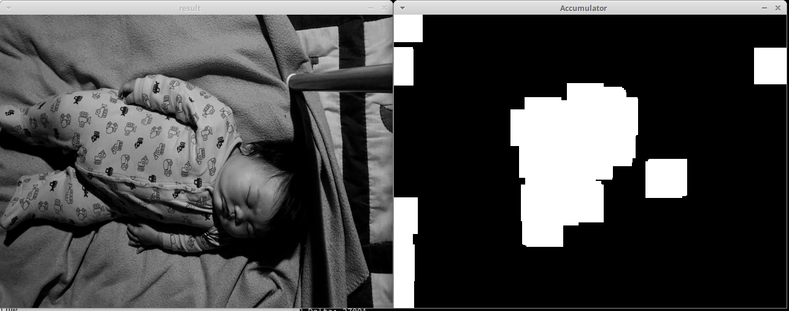

# Configuration

Configuration of CribSense uses a file which is usually located in `/etc/cribsense/config.ini`.

The format is that of INI files: each line is a configuration value, and directives are grouped in section introduced by square brackets. Comments are delimited with `;` to the end of the line.

## Input/Output

The `[io]` section of the file configures the input to CribSense.
You should not need to modify this section, as it is already calibrated to work on the Raspberry Pi.

The `input` directive specifies that the magnifier should look for a video file instead of real-time camera input, while `camera` directive chooses the camera device to use (eg. `camera = 0` means to use `/dev/video0` as input).
File input exists as a demo or debugging feature only.

If you change the input, you must also specify the fps parameters to match the input.
For file input, there is only one fps setting, because frames are never dropped, while for camera input, to reduce latency you must specify the frame per second at full frame size and at cropped frame size (roughly 3x the full frame size fps).
The latter values depend on the speed of the CPU on which cribsense run.
Note that when using an input file that is less than 15 fps, `crop_fps` should be set to the input file's fps value in order to ensure the bandpass frequencies are calculated correctly.

`time_to_alarm` determines the number of system-time seconds to wait after cribsense stops seeing motion before playing an alarm sound through the audio port.

## Cropping

The `[cropping]` section controls the adaptive motion-based cropping, which focuses the magnification process on a smaller Region of Interest (ROI) where the most motion is occurring, reducing the CPU load.

The different parameters affect the latency of detection, as they control the number of "slow" frames (fully uncropped).
Optimal values for the parameters depend on the target CPU.
If you're running on a different device than the Pi, and it's sufficiently powerful, you can also disable cropping altogether.

The default configuration will update the crop approximately every minute.

## Motion & Magnification

The `[motion]` and `[magnification]` sections control the motion detection and video magnification algorithm respectively.

These parameters depend on the setting in which the cribsense is deployed, such as lighting condition and contrast on the baby.
In general, you should not need to change the magnification setting, as it is tuned to detect normal breathing rates.

Calibration may be needed for `erode_dim` and `dilate_dim`, which are used to determine where to crop the video, as well as `diff_threshold` and `pixel_threshold` which determine the thresholds used judge the magnitude of change in pixels and the number of pixels of motion are needed before being classified as motion rather than noise.

Specifically, `diff_threshold` specifies the amount of change a grayscale pixel (value between 0 and 255) will need to change before being marked as changed.
For example, if `diff_threshold` is 30, the difference between a pixels has to be equal to or more than 30 to be marked changed.
The higher this threshold, the more the pixels needs to be different to be marked.

`pixel_threshold` defines a hard cut of in the number of pixels that need to be marked as changed before outputting motion values.
This effectively sets the cutoff for noise when determining whether or not an infant is breathing.
For example, if `pixel_threshold` is set to 100, the algorithm must see more than 100 pixels of change before registering any motion as seen. It will report no motion if that threshold is not crossed.

`erode_dim` specifies the dimension of the kernel to use in an [OpenCV erode operation](http://docs.opencv.org/2.4/doc/tutorials/imgproc/erosion_dilatation/erosion_dilatation.html).
This is used to minimize the changed pixels.
That is, pixels that are isolated will be removed, but when large groups of pixels are changed, they will remain.
`dilate_dim` is the opposite, it takes a pixels and expands it.
These two parameters are used when detecting the region of the frame that the infant is located in.
First, the pixel differences are calculated, then, a small erosion is applied to eliminate noise and a large dilation is applied to broadly mark the areas of motion.

`low-cuttoff` and `high-cutoff` define the range of the bandpass filter used during magnification.
Specifically, video magnification will try to magnify motion that occurs within this frequency range, and ignore motion outside this range.
We've tuned this to be able to capture breathing rats in general, but you may need to tweak this during calibration.

See the section on calibration for more information.

## Debugging features

The `show_diff` flag in `[motion]` will show a window where the areas where motion is detected in the frame are highlighted in white.
The `show_magnification` flag in `[magnification]` controls a window that shows the output of just video magnification (which should look like the camera feed, in black and white, with enlarged motion).
You can use these two flags to show the result of your changes to the motion and magnification parameters.

Finally, the `print_times` in the `[debug]` section controls printing of frame times in the standard output, which you can use to calibrate the FPS and latency settings when running on a device different than the Raspberry Pi.

These features must be left to off when cribsense is started through systemd (automatically on boot or with `systemctl start`). They are only useful if you run cribsense manually.

## Calibrating the Motion & Magnification algorithm

Calibration of the algorithm is an iterative effort, with no right or wrong answer.
We encourage you to experiment with various values, combining them with the debugging features, to find the combination of parameters most suitable to your environment.

As a guideline, increasing the `amplification` and the `phase_threshold` values increases the amount of magnification applied to the input video.
You should change these values until you clearly see the movement from your baby breathing, and no significant artifact in other areas of the video.
If you experience artifacts, reducing the `phase_threshold` while keeping the same `amplification` might help.
You can view the effects of these parameters by setting `show_magnification` to `true`.

As for the motion detection parameters, the main driver is the amount of noise.
When detecting regions of motion to crop to, `erode_dim` and `dilate_dim` are used to size the dimensions of the OpenCV kernels used to [erode and dilate](http://docs.opencv.org/2.4/doc/tutorials/imgproc/erosion_dilatation/erosion_dilatation.html) motion so that noise is first eroded away, then the remaining motion signal is significantly dilated to make the regions of motion obvious.
These parameters may also need to be tuned if your crib is in a very high-contrast setting.
In general, you will need a higher `erode_dim` for high contrast settings, and a lower `erode_dim` for low contrast.

If you run with `show_diff = true` and you notice that too much of the input video is white, or some completely unrelated part of the video is detected as motion (e.g. a flickering lamp), you'll want to increase the `erode_dim` until only the part of the video corresponding to your breathing baby is the largest section of white.
The top figure shows an example where the erode dimension is too low for the amount of motion in the frame, while the bottom one shows a correctly calibrated frame.




Once this has been calibrated, you'll want to make sure that the `pixel_threshold` is set so that motion is only reported when you expect, and not constantly (which means you need to cut out the noise).
Ideally, you'll see output like this in your terminal:

```sh
[info] Pixel Movement: 0	 [info] Motion Estimate: 1.219812 Hz
[info] Pixel Movement: 0	 [info] Motion Estimate: 1.219812 Hz
[info] Pixel Movement: 0	 [info] Motion Estimate: 1.219812 Hz
[info] Pixel Movement: 0	 [info] Motion Estimate: 1.219812 Hz
[info] Pixel Movement: 44	 [info] Motion Estimate: 1.219812 Hz
[info] Pixel Movement: 0	 [info] Motion Estimate: 1.219812 Hz
[info] Pixel Movement: 161	 [info] Motion Estimate: 1.219812 Hz
[info] Pixel Movement: 121	 [info] Motion Estimate: 0.841416 Hz
[info] Pixel Movement: 0	 [info] Motion Estimate: 0.841416 Hz
[info] Pixel Movement: 86	 [info] Motion Estimate: 0.841416 Hz
[info] Pixel Movement: 0	 [info] Motion Estimate: 0.841416 Hz
[info] Pixel Movement: 0	 [info] Motion Estimate: 0.841416 Hz
[info] Pixel Movement: 0	 [info] Motion Estimate: 0.841416 Hz
[info] Pixel Movement: 0	 [info] Motion Estimate: 0.841416 Hz
[info] Pixel Movement: 0	 [info] Motion Estimate: 0.841416 Hz
[info] Pixel Movement: 0	 [info] Motion Estimate: 0.841416 Hz
[info] Pixel Movement: 0	 [info] Motion Estimate: 0.841416 Hz
[info] Pixel Movement: 0	 [info] Motion Estimate: 0.841416 Hz
[info] Pixel Movement: 0	 [info] Motion Estimate: 0.841416 Hz
[info] Pixel Movement: 0	 [info] Motion Estimate: 0.841416 Hz
[info] Pixel Movement: 0	 [info] Motion Estimate: 0.841416 Hz
[info] Pixel Movement: 0	 [info] Motion Estimate: 0.841416 Hz
[info] Pixel Movement: 0	 [info] Motion Estimate: 0.841416 Hz
[info] Pixel Movement: 0	 [info] Motion Estimate: 0.841416 Hz
[info] Pixel Movement: 0	 [info] Motion Estimate: 0.841416 Hz
[info] Pixel Movement: 97	 [info] Motion Estimate: 0.841416 Hz
[info] Pixel Movement: 74	 [info] Motion Estimate: 0.839298 Hz
[info] Pixel Movement: 0	 [info] Motion Estimate: 0.839298 Hz
[info] Pixel Movement: 60	 [info] Motion Estimate: 0.839298 Hz
[info] Pixel Movement: 0	 [info] Motion Estimate: 0.839298 Hz
[info] Pixel Movement: 0	 [info] Motion Estimate: 0.839298 Hz
[info] Pixel Movement: 0	 [info] Motion Estimate: 0.839298 Hz
[info] Pixel Movement: 0	 [info] Motion Estimate: 0.839298 Hz
[info] Pixel Movement: 48	 [info] Motion Estimate: 0.839298 Hz
[info] Pixel Movement: 38	 [info] Motion Estimate: 0.839298 Hz
[info] Pixel Movement: 29	 [info] Motion Estimate: 0.839298 Hz
[info] Pixel Movement: 28	 [info] Motion Estimate: 0.839298 Hz
[info] Pixel Movement: 22	 [info] Motion Estimate: 0.839298 Hz
[info] Pixel Movement: 0	 [info] Motion Estimate: 0.839298 Hz
[info] Pixel Movement: 0	 [info] Motion Estimate: 0.839298 Hz
[info] Pixel Movement: 0	 [info] Motion Estimate: 0.839298 Hz
[info] Pixel Movement: 0	 [info] Motion Estimate: 0.839298 Hz
```
Where there is a clear periodic pattern corresponding to the motion.

If your output looks more like this:

```
[info] Pixel Movement: 921	 [info] Motion Estimate: 1.352046 Hz
[info] Pixel Movement: 736	 [info] Motion Estimate: 1.352046 Hz
[info] Pixel Movement: 666	 [info] Motion Estimate: 1.352046 Hz
[info] Pixel Movement: 663	 [info] Motion Estimate: 1.352046 Hz
[info] Pixel Movement: 1196	 [info] Motion Estimate: 1.352046 Hz
[info] Pixel Movement: 1235	 [info] Motion Estimate: 1.352046 Hz
[info] Pixel Movement: 1187	 [info] Motion Estimate: 1.456389 Hz
[info] Pixel Movement: 1115	 [info] Motion Estimate: 1.456389 Hz
[info] Pixel Movement: 959	 [info] Motion Estimate: 1.456389 Hz
[info] Pixel Movement: 744	 [info] Motion Estimate: 1.456389 Hz
[info] Pixel Movement: 611	 [info] Motion Estimate: 1.456389 Hz
[info] Pixel Movement: 468	 [info] Motion Estimate: 1.456389 Hz
[info] Pixel Movement: 371	 [info] Motion Estimate: 1.456389 Hz
[info] Pixel Movement: 307	 [info] Motion Estimate: 1.456389 Hz
[info] Pixel Movement: 270	 [info] Motion Estimate: 1.456389 Hz
[info] Pixel Movement: 234	 [info] Motion Estimate: 1.456389 Hz
[info] Pixel Movement: 197	 [info] Motion Estimate: 1.456389 Hz
[info] Pixel Movement: 179	 [info] Motion Estimate: 1.456389 Hz
[info] Pixel Movement: 164	 [info] Motion Estimate: 1.456389 Hz
[info] Pixel Movement: 239	 [info] Motion Estimate: 1.456389 Hz
[info] Pixel Movement: 733	 [info] Motion Estimate: 1.456389 Hz
[info] Pixel Movement: 686	 [info] Motion Estimate: 1.229389 Hz
[info] Pixel Movement: 667	 [info] Motion Estimate: 1.229389 Hz
[info] Pixel Movement: 607	 [info] Motion Estimate: 1.229389 Hz
[info] Pixel Movement: 544	 [info] Motion Estimate: 1.229389 Hz
[info] Pixel Movement: 499	 [info] Motion Estimate: 1.229389 Hz
[info] Pixel Movement: 434	 [info] Motion Estimate: 1.229389 Hz
[info] Pixel Movement: 396	 [info] Motion Estimate: 1.229389 Hz
[info] Pixel Movement: 375	 [info] Motion Estimate: 1.229389 Hz
[info] Pixel Movement: 389	 [info] Motion Estimate: 1.229389 Hz
[info] Pixel Movement: 305	 [info] Motion Estimate: 1.312346 Hz
[info] Pixel Movement: 269	 [info] Motion Estimate: 1.312346 Hz
[info] Pixel Movement: 1382	 [info] Motion Estimate: 1.312346 Hz
[info] Pixel Movement: 1086	 [info] Motion Estimate: 1.312346 Hz
[info] Pixel Movement: 1049	 [info] Motion Estimate: 1.312346 Hz
[info] Pixel Movement: 811	 [info] Motion Estimate: 1.312346 Hz
[info] Pixel Movement: 601	 [info] Motion Estimate: 1.312346 Hz
[info] Pixel Movement: 456	 [info] Motion Estimate: 1.312346 Hz
```
Then you'll need to adjust `pixel_threshold` and `diff_threshold` until just peaks are seen, and pixel movement is 0 otherwise.
