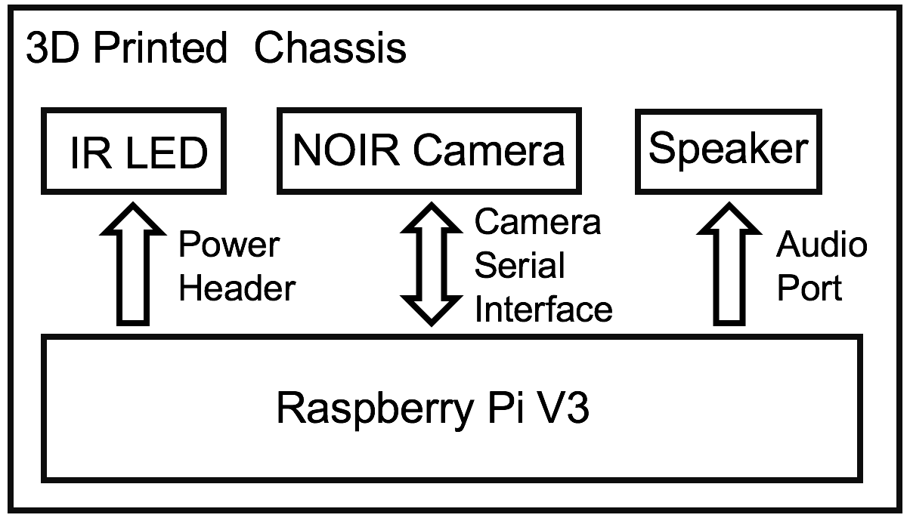
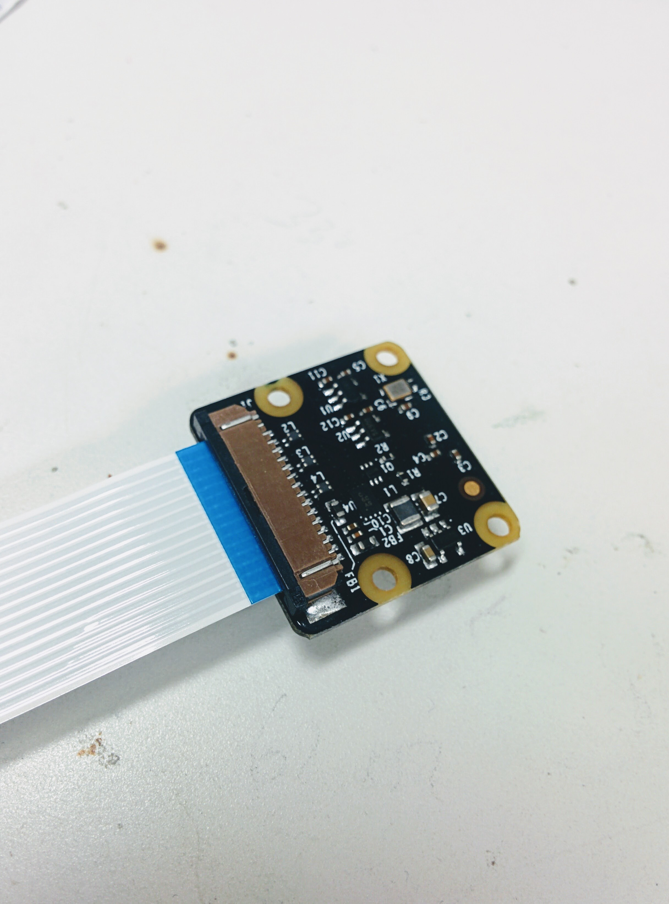
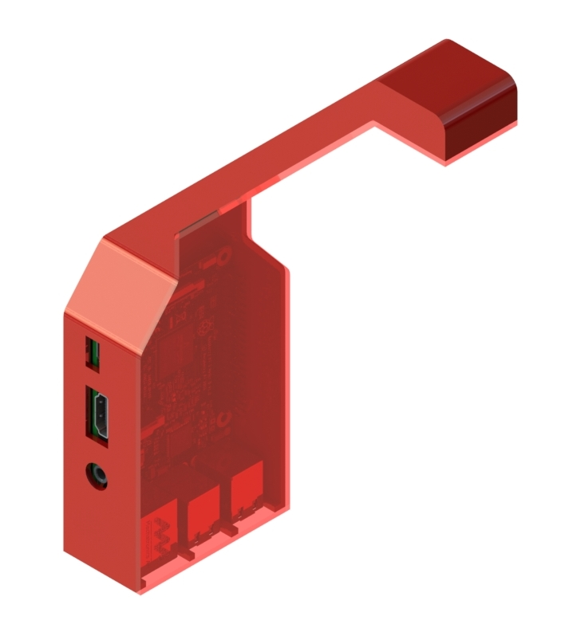
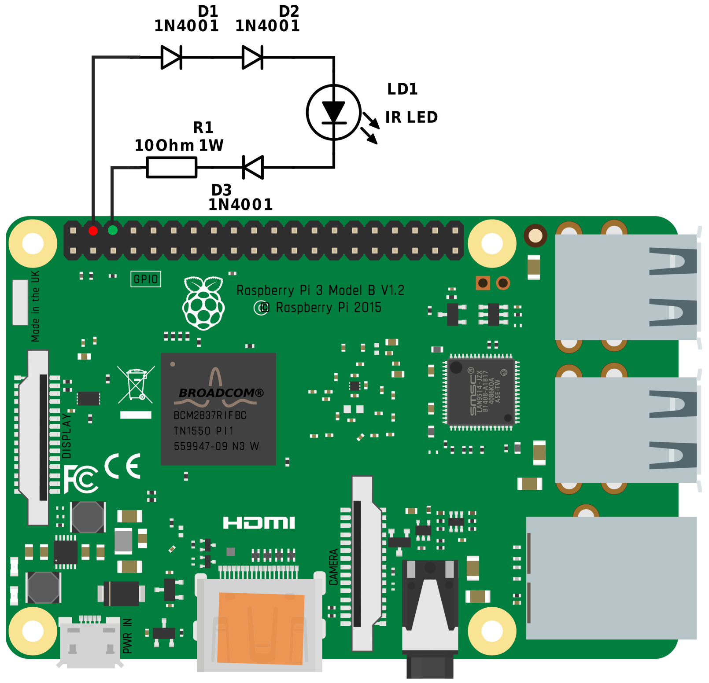
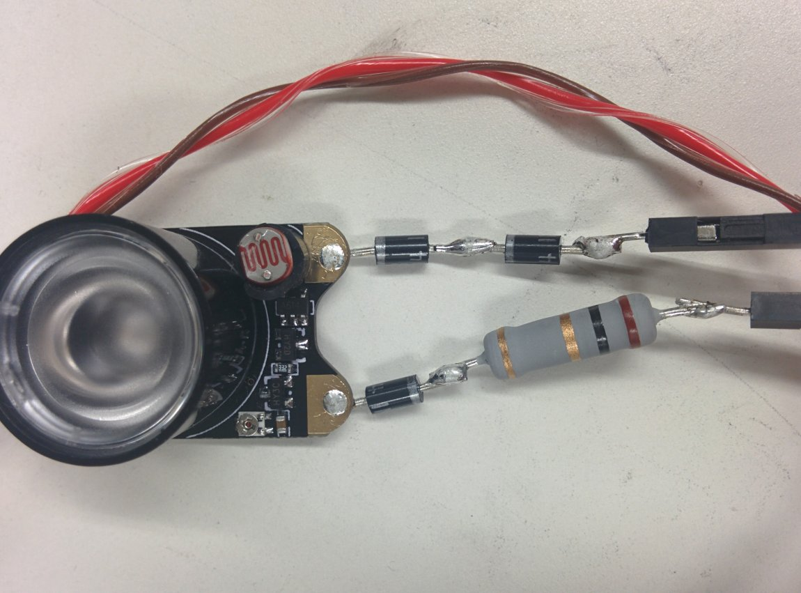
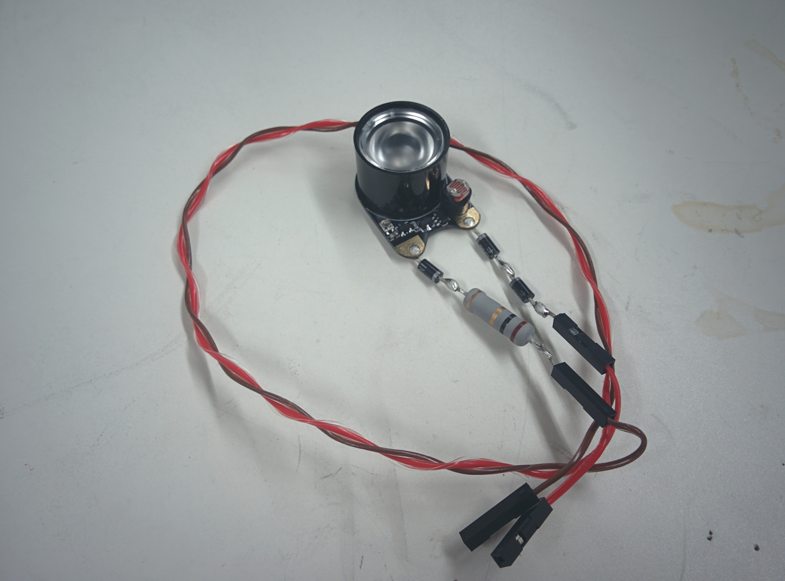
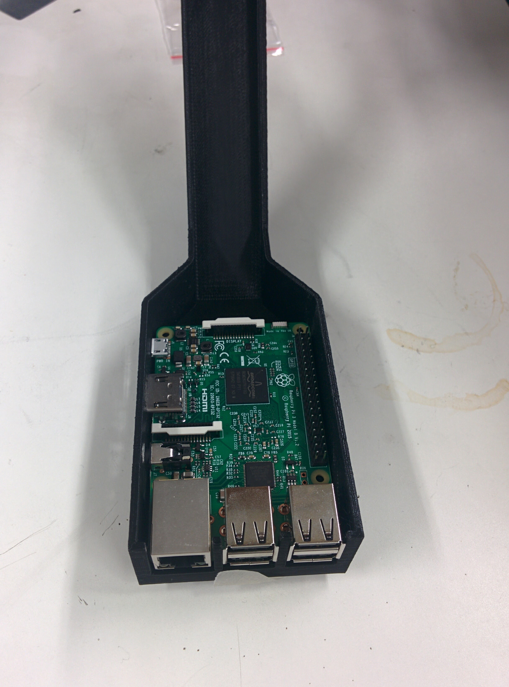
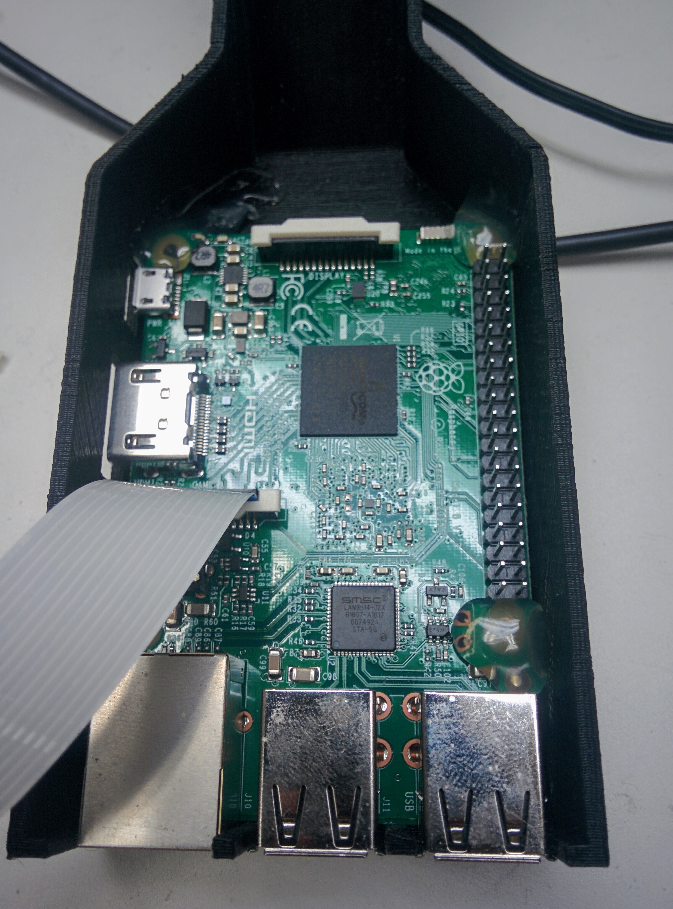
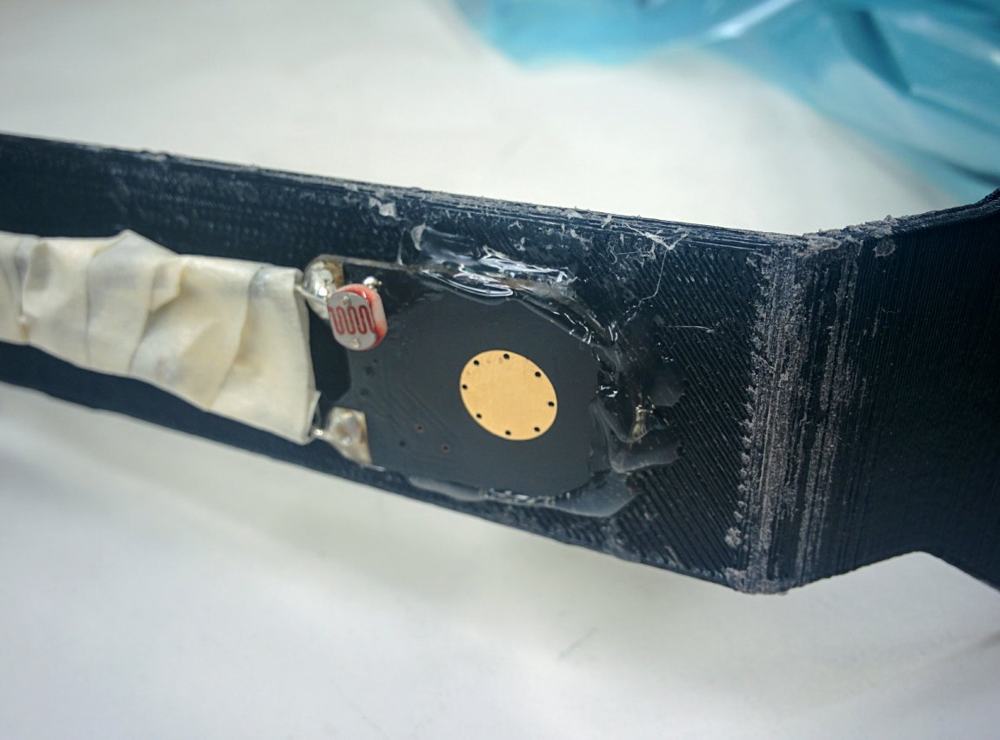
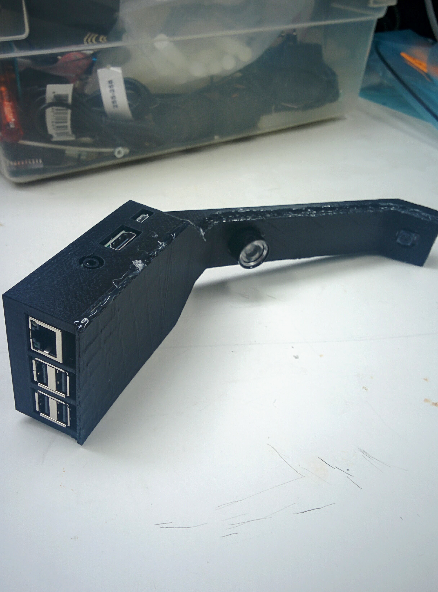

# Hardare Setup Guide

**Figure: Hardware Block Diagram**

CribSense is relatively easy to construct, and is largely made up of commercially available parts.
As seen in the figure above, there are 5 main hardware components, only 2 of which are custom made.
This page contains the build instructions for CribSense.

## What you'll need

Raspberry Pi + Camera + configuration tools:

-   [Raspberry Pi 3 Model B](https://www.amazon.com/Raspberry-Pi-RASP-PI-3-Model-Motherboard/dp/B01CD5VC92/)
-   [5V 2.5A Micro USB Power Supply](https://www.amazon.com/gp/product/B00MARDJZ4/)
-   [Raspberry Pi NoIR Camera Module V2](https://www.amazon.com/Raspberry-Pi-NoIR-Camera-Module/dp/B01ER2SMHY)
-   [1W IR LED](https://www.amazon.com/DIYmall%C2%AE-Infrared-Adjustable-Resistor-Raspberry/dp/B00NUOO1HQ)
-   [MicroSD Card](https://www.amazon.com/Samsung-Class-Adapter-MB-MP32DA-AM/dp/B00IVPU7KE) (we used a Class 10 16GB card, the faster the card the better)
-   [Flex Cable for Raspberry Pi Camera (12")](https://www.adafruit.com/products/1648)
-   Speakers with 3.5mm input
-   HDMI monitor
-   USB Keyboard
-   USB Mouse
-   \[optional] [Raspberry Pi Heatsink](https://www.amazon.com/LoveRPi-Heatsink-Raspberry-Model-Heatsinks/dp/B018BGRDVS/) (If you're worried about heat, you can stick these onto your Pi.)

IR LED Circuit for low-light operation:

-   [\[3x\] 1N4001 diodes](https://www.adafruit.com/product/755)
-   [1 ohm, 1W resistor](http://www.parts-express.com/10-ohm-1w-flameproof-resistor-10-pcs--003-1)
-   [2x] 12" Wires with pin headers
-   Soldering iron

Chassis:

-   Access to a 3D printer (minimum build volume = 9.9" L x 7.8" W x 5.9" H) to print the chassis
-   Glue (any type of glue will will work, but hot glue is recommended for prototyping)

## Prerequisites

Before you start our step-by-step guide, you should have already installed the latest version of [Raspbian](https://www.raspberrypi.org/downloads/raspbian/) on your SD card and ensured that your Pi is functional and booting.
You'll also need to [enable the camera module](https://www.raspberrypi.org/documentation/configuration/camera.md) before you'll be able to interface with the camera.

## Build Instructions

### Swap NoIR Camera Cable

The 6" cable that comes with the camera is too short.
Swap the short one (6") with the longer one (12").
To do this, you can follow [this guide from ModMyPi](https://www.modmypi.com/blog/how-to-replace-the-raspberry-pi-camera-cable).
To summarize, there is a push/pull tab on the back of the NoIR camera, just like the one found on the Pi itself:

Simply pull the black plastic tab out, remove the short cable, replace it with the long cable (making sure that the blue plastic strip is facing up still as shown in the picture), and push the tab back in to secure it.

### 3D Printed Chassis

Using our chassis is optional, though recommended to prevent young children from touching exposed electronic circuitry.
Every crib is different, so our chassis does not include include a mounting bracket.
Several mounting options could include:

-   [Cable Ties](https://www.amazon.com/Miady-Pieces-Self-Locking-Nylon-Inches/dp/B01M0IL0GO/)
-   [3M Dual Lock](https://www.amazon.com/3M-Reclosable-Fastener-SJ3560-Clear/dp/B00PX22H42/)
-   [Velcro](https://www.amazon.com/VELCRO-Brand-Industrial-Strength-Black/dp/B00006RSP1/)
-   Tape

If you have access to a MakerBot Replicator (5th Generation), you can simply download the `.makerbot` files for the [case](https://github.com/lukehsiao/CribSense/raw/master/chassis/case.makerbot) and [cover](https://github.com/lukehsiao/CribSense/raw/master/chassis/cover.makerbot) onto your MakerBot Replicator and print.
It takes about 6 hours to print the case and 3 hours to print the cover.
If you are using a different type of 3D printer, please keep reading.

As mentioned above, a minimum build volume of 9.9" (L) x 7.8" (W) x 5.9" (H) is required to print CribSense.
If you do not have access to a 3D printer with this build volume, you can use an online 3D printing service (such as [Shapeways](http://www.shapeways.com/) or [Sculpteo](https://www.sculpteo.com/)) to print CribSense.
The minimum print resolution is 0.015".
If you are using a [fused filament fabrication](https://en.wikipedia.org/wiki/Fused_filament_fabrication) type 3D printer, this means that your nozzle diameter needs to be 0.015" or smaller.
Printers with lower print resolutions (larger nozzle diameters) may work, but the Raspberry Pi might not fit into the chassis.
We recommend PLA (polylactic acid) as the preferred printing material.
Other plastics may work, but the Raspberry Pi may not fit in the case if the thermal expansion coefficient of the chosen plastic is larger than that of PLA.
If your 3D printer has a heated build plate, turn off the heater before proceeding.

Orienting the model on your printer's build plate is critical for a successful print.
These models were carefully designed so they do not need to be printed with support material, thus saving plastic and improving print quality.
Before proceeding, download the 3D files for the [case](https://github.com/lukehsiao/CribSense/blob/master/chassis/case.stl) and [cover](https://github.com/lukehsiao/CribSense/blob/master/chassis/cover.stl).
When printing these models, the neck of CribSense must lay flat on the build plate.
This ensures that all overhang angles on the models do not exceed 45 degrees, thus eliminating the requirement for support material.
For instructions on orientating 3D models in the build volume of your printer, please refer to the instruction manual that comes with your 3D printer.
Examples for the build orientation of the case and cover are shown below.

Case:

Cover:

In addition to putting the neck of CribSense flat against the build plate, you may notice that the models are rotated around the vertical axis.
This may be necessary to fit the model inside the build volume of your 3D printer.
This rotation is optional if the length of your build volume is long enough to accommodate CribSense.

### IR LED Circuit

In order to provide adequate lighting at night, we use an IR LED, which is not visible to the human eye but visible to the NoIR camera.
The IR LED does not consume a lot of power compared to the Raspberry Pi, so we leave the IR LED on for the sake of simplicity.

To power the LED from the GPIO header pins on the Pi, we construct the circuit in the figure below.

**Figure: LED Schematic**

In earlier versions of the Pi, the maximum output current of these pins was [50mA](http://pinout.xyz/pinout/pin1_3v3_power).
The Raspberry Pi B+ increased this to 500mA.
However, for simplicity and backwards compatibility, we use the 5V power pins, which can supply up to [1.5A](http://pinout.xyz/pinout/pin2_5v_power).
The forward voltage of the IR LED is about 1.7~1.9V according to our measurements.
Even though the IR LED has a maximum current of 500mA, we decided to reduce the current to around 200mA to reduce heat and overall power consumption.
Experimental results also show that the IR LED is bright enough with 200 mA of input current.
To bridge the gap between 5V and 1.9V, we decided to use three 1N4001 diodes and a 1 Ohm resistor in series with the IR LED.
The voltage drop over the wire, diodes and resistor is about 0.2V, 0.9V (for each one) and 0.2V, respectively.
Thus, the voltage over the IR LED is `5V - 0.2V - (3 * 0.9V) - 0.2V = 1.9V`.
The heat dissipation over each LED is 0.18W, and is 0.2W over the resistor, all well within the maximum ratings.

The circuit should looking something like this:

But, we're not done yet!
In order to get a better fit in the 3D printed chassis, we want to have the IR LED lens protrude from our chassis and have the PCB board flush with the hole.
The small photodiode in the bottom right will get in the way.
To remedy this, we desolder it and flip it to the opposite side of the board like this:

The photodiode is not needed since we want the LED to always be on.
Simply switching it to the opposite side leaves the original LED circuit unchanged.

### Assembly: Bring it all together

Once you have all the hardware ready, you can begin assembly.
Any glue can be used in this process, but we recommend hot glue for two main reasons.
Hot glue drys quickly, so you do not need to wait a long time for the glue to dry.
In addition, hot glue is removable if you make a mistake.
To remove dried hot glue, soak the hot glue in in rubbing (isopropyl) alcohol.
We recommend 90% concentration or higher, but 70% concentration will still work.
Soaking the dried hot glue in isopropyl alcohol will weaken the bond between the glue and underlying surface, allowing you to peel the glue off cleanly.
When soaking the glue in isopropyl alcohol, the Raspberry Pi should be powered off and unplugged.
Be sure to let everything dry before reapplying hot glue and booting the Raspberry Pi.

The assembly instructions below assume that you are using hot glue.
If you are using a different type of glue, the assembly instructions still apply, though the drying times may differ.
Throughout this process, make sure that the glue is dry before moving on to the next step.
Throughout the build, check to make sure that all the ports can still be accessed through the holes in the CribSense chassis.
Click any of the pictures below for higher resolution images.

-   Insert the Raspberry Pi into the chassis. Once it is in place, be sure that all of the ports can still be accessed (e.g. you can plug in power power).

-   Next, use hot glue to tack the Pi into place and attach the camera to the Pi. There are screw holes as well if you prefer to use those.

-   Glue the LED and camera to the front cover.

-   First, glue the NoIR camera to the camera hole. Be sure that the camera is snug and lined up with the chassis. Do not use too much glue; otherwise, you will not be able to fit the camera into the main case. Be sure to power on the Pi and take a look at the camera (`raspistill -v`, for example) to make sure that it is angled well and has a good field of view. If it is not, remove the hot glue and reposition it.

-   Next, glue the IR LED to the hole on the neck of the cover. It's at a 45 degree angle to side light the crib, which results in more shadows in low-light situations. This adds more contrast to the image, making it easier to detect motion.

-   With both of them glued to the neck, it should look like this:

-   Attach the IR LED wires to the Raspberry Pi's GPIO pins as shown in the LED Schematic figure.
-   Pack the cables into the chassis in a way that does not crease or strain them. We ended up folding the cable accordion style because our camera flex cable was too long.

-   With everything tucked in, hot glue around the edges where the two pieces meet, sealing them in place.

