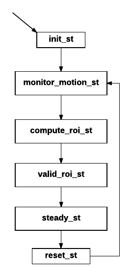

# Software Setup Guide

This is the step-by-step guide on building the CribSense software on Raspbian/Ubuntu.

## Prerequisites

This software depends on [autoconf](https://www.gnu.org/software/autoconf/autoconf.html), [libtool](https://www.gnu.org/software/libtool/), [OpenCV](http://opencv.org/) and [libcanberra](https://en.wikipedia.org/wiki/Libcanberra). Install these by running

```sh
sudo apt-get install git build-essential libtool autoconf libopencv-dev libcanberra-dev
```

Next you need to set to camera driver to autoload by adding `bcm2835-v4l2` to `/etc/modules-load.d/modules.conf`.
Your `modules.conf` should look like this:

```sh
# /etc/modules: kernel modules to load at boot time.
#
# This file contains the names of kernel modules that should be loaded
# at boot time, one per line. Lines beginning with "#" are ignored.

i2c-dev
bcm2835-v4l2
```
Once you've added the line and saved the file, **reboot your Raspberry Pi**.
This is the driver used by CribSense to directly pull frames from the NoIR Camera.


## Build

To build the software, navigate to the root of the repository directory and run

```sh
./autogen.sh --prefix=/usr --sysconfdir=/etc --disable-debug
make
sudo make install
sudo systemctl daemon-reload
```
## Usage

To start the program in the background:

```sh
sudo systemctl start cribsense
```

To run it in the foreground:

```sh
cribsense --config /etc/cribsense/config.ini
```

To start the program automatically at every boot:

```sh
sudo systemctl enable cribsense
```

To stop cribsense from automatically running at boot:

```sh
sudo systemctl disable cribsense
```

Note that when `cribsense` is started using `systemctl`, the config parameters are already sent and are stored in `/etc/systemd/system/cribsense.service`

Once you have installed the software and have it configured well for your setting, you will no longer need the keyboard/mouse/monitor. Now, you can set your CribSense to autorun at every boot as shown above.

Now, all you'll need to do is plug in speakers, attach the CribSense to your previously tested spot on the side of your crib, and plug it in. The software will automatically run after a few moments, and will begin tracking motion. When you're done, well, we don't have an elegant way for you to turn off the Pi yet. But, you can just unplug the speakers and leave it running (and be sure to set the infant in the crib for a couple minutes before plugging them back in). Directly unplugging the Pi may corrupt your SD card.

Remember that if the environment changes, you'll probably need to reconfigure. You'll want to disable the autorun using the command above, and go through the calibration steps on the [Configuration Page](./config.md).

If something doesn't seem to be working, you can checkout our [Troubleshooting Page](./troubleshooting.md)

Tip: If everything is set up, you can [make a backup of your Raspberry Pi SD Card](https://www.raspberrypi.org/documentation/linux/filesystem/backup.md) for easy restoration if something goes wrong.

## Software Configuration

CribSense customizable through a simple INI configuration file.
After running `make install`, the configuration file is located at:

```sh
sudo nano /etc/cribsense/config.ini
```

and it will look like this
```ini
[io]                  ; I/O configuration
; input = vid/noir_cam/lowres_10fps_orange_2min.h264   ; Input file to use
input_fps = 15          ; fps of input (40 max, 15 recommended if using camera)
full_fps = 4.5          ; fps at which full frames can be processed
crop_fps = 15           ; fps at which cropped frames can be processed
camera = 0              ; Camera to use
width = 640             ; Width of the input video
height = 480            ; Height of the input video
time_to_alarm = 10      ; How many seconds to wait with no motion before alarm.

[cropping]            ; Adaptive Cropping Settings
crop = true                 ; Whether or not to crop
frames_to_settle = 10       ; # frames to wait after reset before processing
roi_update_interval = 800   ; # frames between recalculating ROI
roi_window = 50             ; # frames to monitor before selecting ROI

[motion]              ; Motion Detection Settings
erode_dim = 4           ; dimension of the erode kernel
dilate_dim = 60         ; dimension of the dilate kernel
diff_threshold = 8      ; abs difference needed before recognizing change
duration = 1            ; # frames to maintain motion before flagging true
pixel_threshold = 5     ; # pixels that must be different to flag as motion
show_diff = false       ; display the diff between 3 frames

[magnification]       ; Video Magnification Settings
amplify = 25                ; The % amplification desired
low-cutoff = 0.5            ; The low frequency of the bandpass.
high-cutoff = 1.0           ; The high frequency of the bandpass.
threshold = 50              ; The phase threshold as % of pi.
show_magnification = false  ; Show the output frames of each magnification

[debug]
print_times = false ; Print analysis times

```

View the full configuration details on the [Configuration Page](./config.md)

## Software Architecture Details
The CribSense software is the heart and soul of this project.
The rest is mainly a fun opportunity to use a 3D printer and do some soldering.
We saw some of the great demos of [video magnification](http://people.csail.mit.edu/mrub/vidmag/) from MIT, and wanted to try and run a similar algorithm on a Raspberry Pi.
 This required about 10x speedup from the great work of [tbl3rd on his C++ implementation](https://github.com/tbl3rd/Pyramids) of video magnification in order to run in real-time on the Pi.
 The optimizations needed guided our design of the software.

The software for processing a video stream is implemented as a state machine that cycles as shown below.
There are currently six states that manage all of our processing steps.
Our state machine logic is called each time a new frame is read from the camera.



### Initialization

When the video stream first turns on, it is common to have a flash of white or black pixels that looks like a lot of motion is happening.
This state simply initializes the video magnification and motion detection code, and skips a few of the first frames before jumping into monitoring motion.

### Monitoring Motion

In this state, the full 640 x 480 frame is magnified, and uses an image differential algorithm from Collins et al. to calculate the motion pixels between frames.
The output of this algorithm is a black and white image where white pixels indicate pixels that have changed.
These black and white images are then bitwise ORed together for several frames to accumulate the motion seen over the period of time.

### Computing a Region of Interest

With the accumulated black and white frame representing the motion seen over several frames, the image is eroded slightly to eliminate noise, then significantly dilated to highlight the areas with the most motion.
Dilation is necessary to merge discrete points into continuous regions of motion.
Because of the large dilation, it is then easy to find the largest contour in the black and white image, which represents the main source of motion, and draw a bounding box around the contour.
It is in this portion of code that we can set bounds on the size of the crop.

### Steady State

This is where our software spends most of its time.
In this state, the software is operating on cropped frames.
Video magnification is performed and a measure of the movement seen in the frame is calculated.
In this state, we are able to process at a fast enough rate to catch up with any delay caused during the processing of full frames, and keep up with our 10fps video stream.

### Periodic Reset

Because the baby may move occasionally, we periodically reset the video magnification and cropping so that we have full-resolution frames available to repeat the process of monitoring motion and finding a new region of interest.
All of these timing parameters are easily configurable.

## Technical Challenges

### Speed

When we started this project, our C++ implementation could magnify video at a rate of 394,000 pixels per second on the Raspberry Pi 3.
For reference, this meant our code could only process a 640 x 480 video stream at a rate of approximately 1.3 frames per second.  
Optimizing our code to handle the real-time goal was our primary objective and challenge, since we needed a 10x speed-up to handle at least 10 frames per second.
Now, we are able to process over 1,200,000 pixels per second, and use additional cropping to process a 10 fps video stream in real time.

We used three main optimizations increase performance by 10x: (1) multithreading, (2) adaptive cropping, and (3) compiler optimization. Each optimization is explained in more detail below.

#### Multithreading (~3x)

One intuitive and high-value optimization was to process sections of each video frame in parallel.
To do so, we divide each frame vertically, such that each section's height is one-third of the original frame.
Then, each section is magnified as if it was its own video stream.
The resulting magnified frames are then joined together to form a full-resolution frame before evaluating the frame for motion.
This optimization alone brought our processing rate to 938,000 pixels per second (roughly a 3x improvement).
Three of the Raspberry Pi's four cores are dedicated to video magnification, while the 4th core handles control flow and motion processing.

#### Adaptive Cropping (~3x)

While multithreading sought to increase the number of pixels we could process each second, adaptive cropping sought to decrease the number of pixels we needed to process.
We rely on two main assumptions for this optimization.
First, the camera captures the entire crib in its field of view and the baby is the only source of movement in the frame.
Second, the camera is placed such that movement is discernible, and the region of interest is not larger than one-third of the frame.
With these assumptions, we are able to periodically monitor a full frame to determine where the motion is occurring, then crop down the stream to only contain the relevant motion.
By reducing the number of pixels that we process in our steady state, and amortizing the cost of monitoring a few full-resolution frames, we are able to increase the number of frames we can handle each second by about 3x.

#### Compiler Optimizations (~1.2x)

Finally, in order to reach our goal of over 10x speedup, we were able to make some code optimizations and utilize additional compiler flags.
In particular, we make use of the -O3 optimization level, and we force the compiler to generate vector instructions with `-ftree-vectorize` and `-mfpu=crypto-neon-fp-armv8`.
Additionally, we were required to add the `-funsafe-math-optimization` flag to enable the vector float generation, because NEON instructions are not IEEE compliant and gcc would not generate them otherwise.

We found two major challenges in enabling compiler optimization.
The first was to expose the operations to the compiler.
The most expensive part of transformation happens in two all-pixel loops, but previously each operation in the loop was implemented with an opencv call that would run the operation over all pixels.
We rewrote the code to pull out the loop and avoid intermediate copies.
On an x86-64 machine, this is already an improvement, because of larger caches and the fact that the compiler always issues at least SSE2 vector instructions.
In contrast, the switch from vector instruction enabled opencv to straight C++ code resulted in worse performance on the Pi.

We recovered this performance drop by adding the compiler flags, but we encountered toolchain problems.
The Pi 3 has an ARM Cortex A53 processor, which is an A-class 64-bit ARMv8 with NEON and crypto extensions, but it runs a 32-bit OS compiled for ARMv7.
We found first that compiling with `-march=native` exposes a known but yet unfixed GCC bug.
Compiling with `-march=armv8` appears to work, but generates ABI incompatible binaries when linked with an ARMv7 libstdc++, leading to stack corruption.
On the other hand, leaving the default of -march=armv7 and forcing just the FPU to generate NEON appears to work, looking at the assembly.
We also added `-mtune=cortex-a53` to achieve better instruction scheduling and better counts for loop unrolling (which is enabled at -O3), but we suspect it has no effect because the version of GCC we use (4.9.2, provided by Raspbian) does not recognize it.

### Profiling

In order to isolate further optimization spots, we employed profiling to identify where the code is spending most of the time.
In doing so, we also encountered toolchain problems, as `valgrind` is unable to emulate the NEON vector instructions and crashes.
We therefore turned to `gprof`, but we found its timing somewhat unreliable, despite the `-fno-inline` switch (function call counts on the other hand are precise but not quite useful).
Finally, we tried `perf`, which uses the HW performance counters and gives us instruction level timings, but we found that it is very precise inside the transformation code, and has zero data outside, because it sees no sample of the other code.
Overall, profiling suggests that 96% of the time is spent in the transformation and 2% in motion detection, with the rest being threading and locking overhead, and accessing the camera.

### Timing

Overall, our algorithm is able to process a full 640x480 frame in 220 to 240 ms, while after cropping our algorithm runs in the worst case (where the crop is approximately 320x320) at about 70 ms per frame.
This allows us to maintain a steady 10 fps goal.
